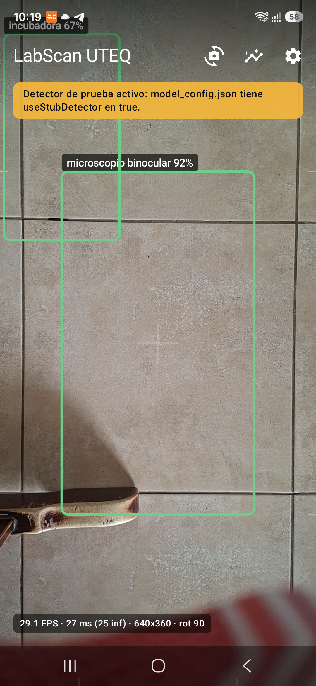
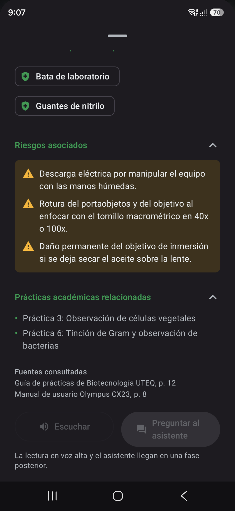
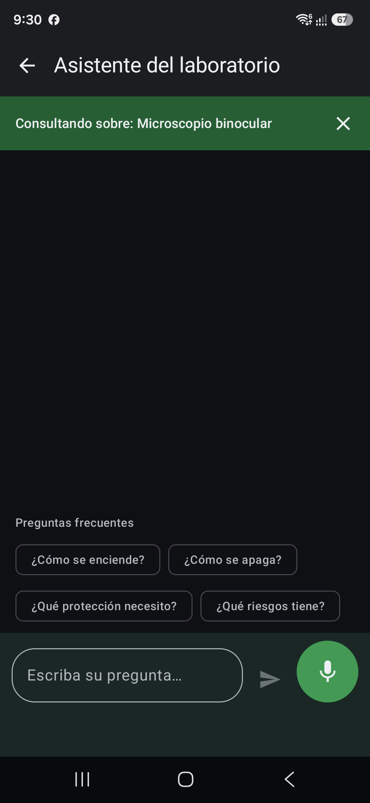
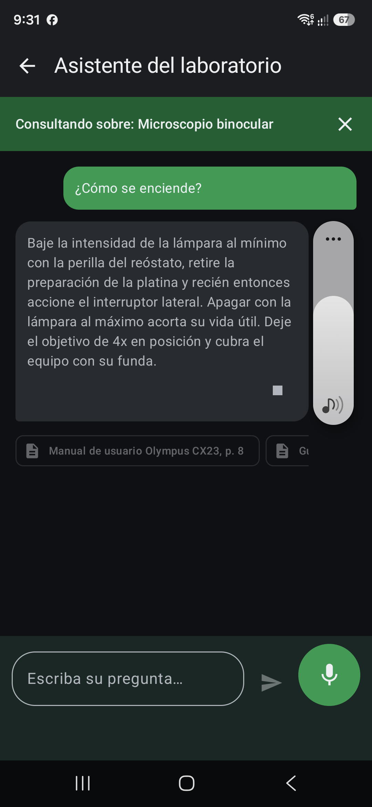
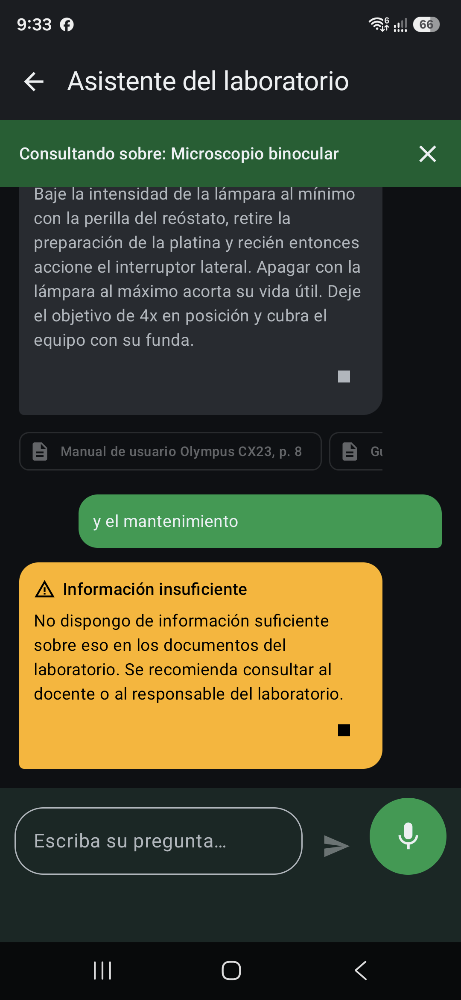
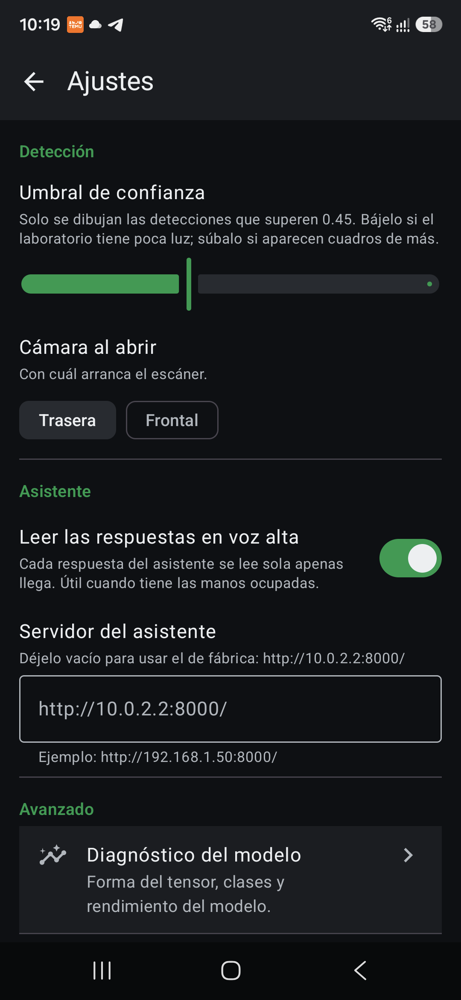

# LabScan UTEQ

Asistente móvil de detección de equipos de laboratorio de la **Universidad Técnica Estatal de
Quevedo**, Laboratorio de Biotecnología.

Un estudiante de primer semestre entra al laboratorio, abre la app y apunta con la cámara. La app
dibuja un cuadro sobre cada equipo con su nombre y confianza. Toca un cuadro y se abre la ficha
técnica. Desde ahí puede **hablarle** a la app y preguntar cómo se enciende, cómo se apaga o qué
protección necesita. La respuesta viene de un LLM con RAG sobre los manuales y las guías de
práctica de la UTEQ, y **siempre cita su fuente**.

| Escáner | Ficha técnica | Chat por voz |
|---|---|---|
|  |  |  |

| Respuesta con fuente | Información insuficiente | Ajustes |
|---|---|---|
|  |  |  |

---

## Estado

Las ocho fases del plan están terminadas. **La app funciona hoy sin modelo entrenado y sin
backend**: cae a un detector de prueba y a un catálogo local, y lo dice en pantalla. Eso es
deliberado y es lo que permitió construir y verificar toda la aplicación mientras el modelo y el
servidor todavía no existían.

Lo que falta es contenido, no código:

- `app/src/main/assets/model.tflite` — lo entrena Mario. Copiarlo y poner `useStubDetector` en
  `false`. No hay que tocar una sola línea de Kotlin.
- El backend RAG — lo implementa Mario. Contrato cerrado en [`docs/CONTRATO_API.md`](docs/CONTRATO_API.md).

El detalle de qué se hizo en cada fase, con las mediciones tomadas en un teléfono real, está en
[`docs/PROGRESO.md`](docs/PROGRESO.md).

---

## Cómo compilar

Requisitos: **JDK 17+** (vale el que trae Android Studio) y el SDK de Android con `compileSdk 37`.
No hace falta configurar nada más: el proyecto trae su propio wrapper de Gradle.

```bash
./gradlew assembleDebug      # APK de depuración, con backend simulado
./gradlew installDebug       # lo instala en el dispositivo conectado
./gradlew testDebugUnitTest  # 57 pruebas en la JVM, sin dispositivo
./gradlew lintDebug          # análisis estático
./gradlew assembleRelease    # APK firmado y ofuscado
```

APK de entrega: `app/build/outputs/apk/release/app-release.apk`

Para ver qué está pasando por dentro:

```bash
adb logcat -s LabScan
```

### Sobre la firma del APK

El release se firma con `keystore/labscan-demo.jks`, que **viaja dentro del repositorio a
propósito** y cuya contraseña está escrita en `app/build.gradle.kts`. Sirve para que cualquiera
que clone el proyecto pueda generar un APK instalable sin pedir nada a nadie, que es lo que exige
la entrega. No protege nada y no pretende hacerlo: para publicar en Google Play habría que generar
un almacén nuevo, dejarlo fuera del control de versiones y pasarlo por variables de entorno.

---

## Arquitectura

Una sola Activity, todo Compose, **inyección de dependencias manual** en `di/AppContainer.kt`. Sin
Hilt, sin Koin, sin Room. El catálogo local es un JSON en `assets/`.

```
app/src/main/java/ec/edu/uteq/labscan/
  App.kt                  Application: crea el AppContainer y aplica los ajustes guardados
  MainActivity.kt         Host de Compose + NavHost (scanner, chat, ajustes, diagnóstico)
  di/AppContainer.kt      ÚNICO punto de construcción de dependencias
  detection/              Detector, StubDetector, YoloTfliteDetector, YoloDecoder, BoxMapper…
  camera/                 CameraBinder (CameraX) y FrameAnalyzer
  ui/scanner/             Cámara + overlay de cajas + suavizado
  ui/sheet/               Ficha técnica (ModalBottomSheet)
  ui/chat/                Conversación con el asistente
  ui/settings/            Ajustes y "Acerca de"
  ui/diagnostics/         Forma del tensor, clases y rendimiento
  voice/                  TtsManager y SttManager (APIs de plataforma, nada en la nube)
  data/remote/            Retrofit, DTO del contrato, RagRepository, mock del backend
  data/local/             EquipmentCatalog (assets) y SettingsStore (DataStore)
```

Cuatro decisiones que explican casi todo lo demás:

1. **Nada fuera de `detection/` conoce TensorFlow.** El resto de la app ve la interfaz `Detector`
   y la data class `Detection`. Es lo que permite cambiar de modelo, o no tener modelo, sin tocar
   la interfaz de usuario.
2. **La app nunca crashea por culpa del modelo.** Si el asset falta, no carga o no cuadra con
   `labels.txt`, cae a `StubDetector` y muestra el motivo en pantalla.
3. **`BoxMapper` es el único sitio con matemática de coordenadas.** La cadena tensor → letterbox →
   rotación → espejado → recorte de la vista vive ahí y solo ahí, con pruebas en la JVM.
4. **La app nunca envía imágenes al backend.** Solo `classId` y texto. El RAG lo hace el servidor.

Las decisiones técnicas no triviales, con su porqué y lo que se midió para tomarlas, están en
[`docs/DECISIONES.md`](docs/DECISIONES.md) (D-001 a D-022).

---

## Cómo integrar un modelo nuevo

El contrato del tensor y los pasos completos están en
[**`docs/INTEGRACION_MODELO.md`**](docs/INTEGRACION_MODELO.md). En resumen:

1. Copiar `model.tflite` y `labels.txt` a `app/src/main/assets/`.
2. En `assets/model_config.json`, poner `"useStubDetector": false`.
3. Compilar e instalar. Abrir **Ajustes → Diagnóstico del modelo**: ahí se ve la forma real del
   tensor, cuántas clases infirió, si cuadran con `labels.txt` y el rendimiento medido.

La app se adapta sola al tamaño de entrada, a la cuantización y a la disposición de la salida: los
lee del tensor, no de la configuración. Si algo no cuadra, lo dice en Diagnóstico en lugar de
fallar en silencio.

---

## Cómo levantar el backend

El contrato HTTP es **cerrado** y está en [**`docs/CONTRATO_API.md`**](docs/CONTRATO_API.md): tres
endpoints (`/api/health`, `/api/equipment/{classId}`, `/api/chat`), el sobre de error estándar y la
tabla de qué debe hacer la app ante cada fallo.

Mientras el backend no exista, la compilación de depuración trae un **servidor simulado**
(`MockInterceptor`) que responde desde `app/src/debug/assets/mock/` con JSON validados contra el
mismo contrato. Se enciende con `USE_MOCK_API`, que ya está en `true` en debug.

Cuando el backend esté listo:

- **Sin recompilar:** Ajustes → *Servidor del asistente* → escribir la URL (por ejemplo
  `http://192.168.1.50:8000/`).
- **En el proyecto:** cambiar `BASE_URL` y poner `USE_MOCK_API` en `false` en
  `app/build.gradle.kts`.

Para hablar con un backend en HTTP plano desde un teléfono real hay que añadir su IP a
`app/src/debug/res/xml/network_security_config.xml`. Está explicado dentro del propio archivo.

---

## Entregables

- **APK de entrega:** `app/build/outputs/apk/release/app-release.apk`
- **Checklist de la actividad:** [`docs/EVIDENCIAS.md`](docs/EVIDENCIAS.md)
- **Guion del video de demostración:** [`docs/GUION_VIDEO.md`](docs/GUION_VIDEO.md)
- **Bitácora y mediciones:** [`docs/PROGRESO.md`](docs/PROGRESO.md)

---

## Créditos

Proyecto académico de la **Universidad Técnica Estatal de Quevedo**, Laboratorio de Biotecnología.

- **Dariem Alberto Benites Pérez** — aplicación Android: cámara, detección en el dispositivo,
  interfaz, voz e integración.
- **Mario** — entrenamiento del modelo de detección y backend RAG.

Las fichas de `assets/catalog.json` y los textos del backend simulado son **contenido de ejemplo**
redactado para poder construir y probar la interfaz. Antes de usarlos con estudiantes hay que
revisarlos contra los manuales reales de los equipos y contra la guía de prácticas de la UTEQ.
